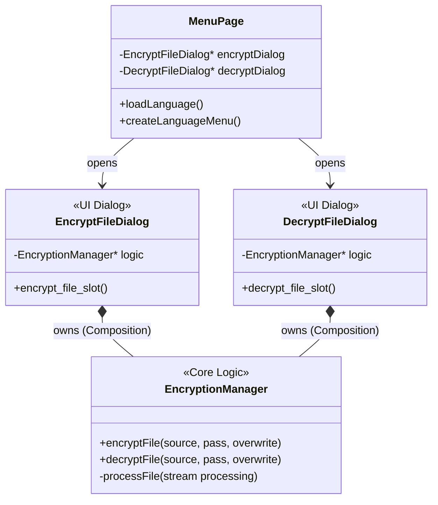

# Qt Desktop File Encryption & Decryption


A modern desktop application for securely encrypting and decrypting files on Linux, Windows, and macOS. Developed with **C++23** and **Qt 6**.

The application uses **AES-256 CBC** encryption and is optimized for high performance with low memory usage (streaming processing).

<hr>

<!-- START doctoc generated TOC please keep comment here to allow auto update -->
<!-- DON'T EDIT THIS SECTION, INSTEAD RE-RUN doctoc TO UPDATE -->
**Table of Contents**

  - [✨ Features](#-features)
  - [🏗️ Architecture](#-architecture)
    - [Structure Diagram](#structure-diagram)
    - [Data Flow (Streaming)](#data-flow-streaming)
- [📂 Project Structure](#-project-structure)
- [🚀 Installation & Build](#-installation--build)
  - [Prerequisites](#prerequisites)
  - [Build Steps](#build-steps)
- [📝 License](#-license)
- [🤝 Author](#-author)

<!-- END doctoc generated TOC please keep comment here to allow auto update -->

<hr>

## ✨ Features

- **Secure Encryption:** Uses AES-256 in CBC mode with SHA-256 hashed passwords.
- **High Performance:** Files are streamed in 4 MB chunks. This allows even **very large files** (GB/TB range) to be encrypted without burdening the RAM.
- **User Friendly:**
  - Always starts in the user's Home directory.
  - Smart path suggestions (saving next to the source file).
  - Drag & Drop support (via file dialog).
- **Internationalization (i18n):**
  - Automatic language detection on first start (English/German).
  - Language switchable via menu (settings are persisted).
- **Cross-Platform:** Runs natively on all systems supporting Qt.

---

## 🏗️ Architecture

The project follows the **"Composition over Inheritance"** principle and strictly separates UI logic from encryption logic.

### Structure Diagram



### Data Flow (Streaming)

To keep memory usage minimal, files are never loaded completely into RAM. Instead, a QFile stream is used:

1. Open: Source and destination files are opened.

2. Loop:

- Read 4 MB chunk from source stream.
- Process block (AES Encode/Decode) via QAESEncryption.
- Write processed block to destination stream.

3. Close: Streams are closed, temporary files are renamed/moved.

# 📂 Project Structure

```Bash
.
├── CMakeLists.txt           # Build configuration
├── resources.qrc            # Qt Resources (Icons, i18n)
├── include/                 # Header files (.h)
│   ├── encryption_manager.h
│   ├── encrypt_file_dialog.h
│   ├── decrypt_file_dialog.h
│   ├── menu_page.h
│   └── ...
└── src/                     # Source files (.cpp)
    ├── main.cpp
    ├── encryption_manager.cpp
    ├── encrypt_file_dialog.cpp
    ├── decrypt_file_dialog.cpp
    └── ...
```

# 🚀 Installation & Build

## Prerequisites

- C++ Compiler with C++23 support (GCC, Clang, MSVC)
- CMake (>= 3.20)
- Qt 6 (Core, Widgets, Gui)

## Build Steps

1. Clone Repository:

```Bash
git clone https://github.com/Zheng-Bote/qt-desktop_file_encryption-decryption.git
cd qt-desktop_file_encryption-decryption
```

2. Create Build Directory:

```Bash
mkdir build && cd build
```

3. Compile with CMake:

```Bash
cmake ..
make -j$(nproc)
```

4. Run:

```Bash
./file_encryption-decryption
```

# 📝 License

This project is released under the MIT License. See LICENSE for details.

# 🤝 Author

Robert ZHENG

- Web: www.robert.hase-zheng.net
- GitHub: Zheng-Bote

Copyright (c) 2024 ZHENG Robert
