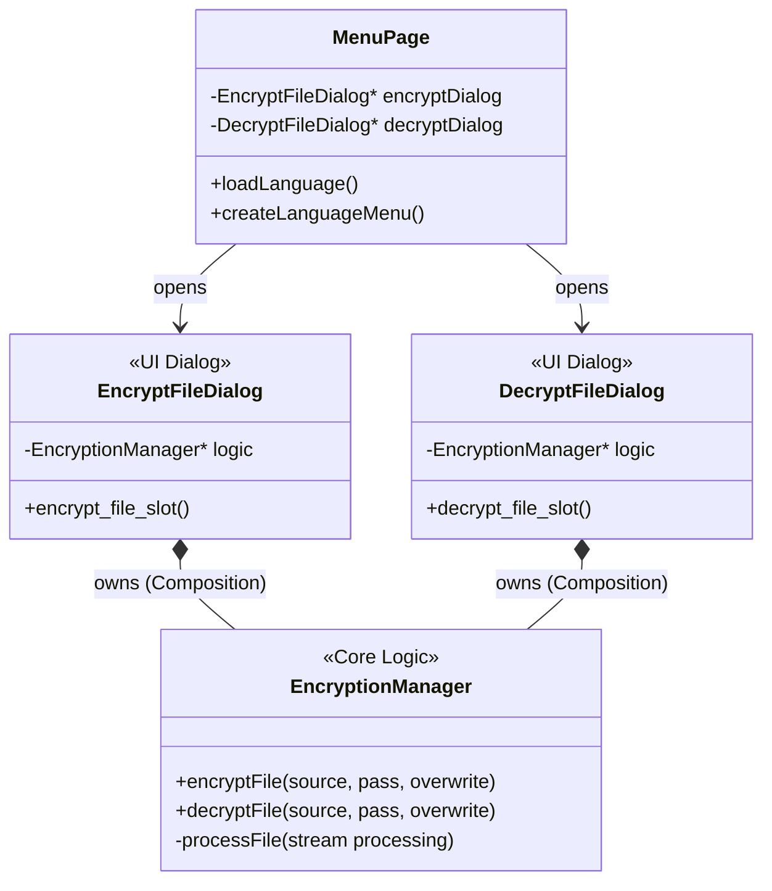

<div id="top" align="center">
<h1>File Encryption & Decryption (Desktop)</h1>

<p>Desktop application for securely encrypting and decrypting files on Linux, Windows, and MacOS</p>

[Report Issue](https://github.com/Zheng-Bote/qt-desktop_file_encryption-decryption/issues) · [Request Feature](https://github.com/Zheng-Bote/qt-desktop_file_encryption-decryption/pulls)

[](https://choosealicense.com/licenses/mit/)
[](https://github.com/Zheng-Bote/qt-desktop_file_encryption-decryption/releases)

</div>

<hr>

<!-- START doctoc generated TOC please keep comment here to allow auto update -->
<!-- DON'T EDIT THIS SECTION, INSTEAD RE-RUN doctoc TO UPDATE -->
**Table of Contents**

- [Description](#description)
  - [✨ Features](#-features)
- [Status](#status)
  - [breaking Changes](#breaking-changes)
- [Getting Started](#getting-started)
- [🚀 Installation & Build](#-installation--build)
  - [Prerequisites](#prerequisites)
  - [📂 Project Structure](#-project-structure)
  - [Build Steps](#build-steps)
  - [i18n](#i18n)
    - [Update Translation Files](#update-translation-files)
    - [Compile Translation Files](#compile-translation-files)
  - [Build Linux AppImage](#build-linux-appimage)
- [Documentation & Screenshots](#documentation--screenshots)
- [SBoM (CycloneDX)](#sbom-cyclonedx)
- [🏗️ Architecture](#-architecture)
  - [Structure Diagram](#structure-diagram)
  - [Data Flow (Streaming)](#data-flow-streaming)
- [Authors and License](#authors-and-license)
  - [📝 License](#-license)
  - [🤝 Authors](#-authors)
    - [Code Contributors](#code-contributors)

<!-- END doctoc generated TOC please keep comment here to allow auto update -->

<hr>

# Description


A modern desktop application for securely encrypting and decrypting files on Linux, Windows, and macOS. Developed with **C++23** and **Qt 6**.

The application uses **AES-256 CBC** encryption and is optimized for high performance with low memory usage (streaming processing).

## ✨ Features

- **Secure Encryption:** Uses AES-256 in CBC mode with SHA-256 hashed passwords.
- **High Performance:** Files are streamed in 4 MB chunks. This allows even **very large files** (GB/TB range) to be encrypted without burdening the RAM.
- **User Friendly:**
  - Always starts in the user's Home directory.
  - Smart path suggestions (saving next to the source file).
  - Drag & Drop support (via file dialog).
- **Internationalization (i18n):**
  - Automatic language detection on first start (English/German).
  - Language switchable via menu (settings are persisted).
- **Cross-Platform:** Runs natively on all systems supporting Qt.

# Status


[](https://github.com/Zheng-Bote/qt-desktop_file_encryption-decryption/releases)


## breaking Changes

> \[!CAUTION]
> Please be aware of breaking changes

| Version | status                                  | Comment                                                            |
| ------- | --------------------------------------- | ------------------------------------------------------------------ |
| v0.1.0  | **NOT** compatible to higher versions.  | initial creation, text mode                                        |
| v1.0.0  | **NOT** compatible with lower versions. | optimized input/output, text mode limited to some text-based files |
| v2.0.0  | **NOT** compatible with lower versions. | binary-mode, works on every readable file. No filesize limit.      |

([back to top](#top))

# Getting Started

> \[!TIP]
> _see_ [Github Pages](https://zheng-bote.github.io/qt-desktop_file_encryption-decryption/) for Usage & Screenshots

> \[!WARNING]
> don't loose your password. Decryption/Recovery without valid password is impossible!

# 🚀 Installation & Build

Several installation packages are available, depending on your Operating System

> \[!TIP]
> see _Releases_ or [Github Pages](https://zheng-bote.github.io/qt-desktop_file_encryption-decryption/)

## Prerequisites

- C++ Compiler with C++23 support (GCC, Clang, MSVC)
- CMake (>= 3.23)
- Qt 6 (Core, Widgets, Gui)

## 📂 Project Structure

```Bash
.
├── CMakeLists.txt           # Build configuration
├── resources.qrc            # Qt Resources (Icons, i18n)
├── include/                 # Header files (.h)
│   ├── encryption_manager.h
│   ├── encrypt_file_dialog.h
│   ├── decrypt_file_dialog.h
│   ├── menu_page.h
│   └── ...
└── src/                     # Source files (.cpp)
    ├── main.cpp
    ├── encryption_manager.cpp
    ├── encrypt_file_dialog.cpp
    ├── decrypt_file_dialog.cpp
    └── ...
```

## Build Steps

1. Clone Repository:

```Bash
git clone https://github.com/Zheng-Bote/qt-desktop_file_encryption-decryption.git
cd qt-desktop_file_encryption-decryption
```

2. Create Build Directory:

```Bash
mkdir build && cd build
```

3. Compile with CMake:

```Bash
cmake ..
make -j$(nproc)
```

4. Run:

```Bash
./file_encryption-decryption
```

## i18n

### Update Translation Files

```Bash
/opt/Qt/6.10.0/gcc_64/bin/lupdate -no-obsolete src/ -ts i18n/qt_file_encryption-decryption_en.ts
```

### Compile Translation Files

```Bash
/opt/Qt/6.10.0/gcc_64/bin/lrelease i18n/qt_file_encryption-decryption_en.ts -qm i18n/qt_file_encryption-decryption_en.qm
```

## Build Linux AppImage

Depending on your Linux distribution you might need to install additional packages to build the AppImage.

```Bash
./create_appimage.sh
```

or

```Bash
./create_appimage_modern.sh
```

([back to top](#top))

---

# Documentation & Screenshots

> \[!NOTE]
> please visit [Github Pages](https://zheng-bote.github.io/qt-desktop_file_encryption-decryption/) for more.


# SBoM (CycloneDX)

```Bash
nvm use --lts
```

```Bash
atom -J-Xmx16g usages -o ./docs/app.atom --slice-outfile ./docs/atom_v2.1.0.json -l cpp ./src
```

```Bash
cdxgen -o ./docs/sbom_v2.1.0.json -t cpp --usages-slices-file ./docs/atom_v2.1.0.json --author "ZHENG Robert" --deep -r ./src
```

# 🏗️ Architecture

The project follows the **"Composition over Inheritance"** principle and strictly separates UI logic from encryption logic.

## Structure Diagram



## Data Flow (Streaming)

To keep memory usage minimal, files are never loaded completely into RAM. Instead, a QFile stream is used:

1. Open: Source and destination files are opened.

2. Loop:

- Read 4 MB chunk from source stream.
- Process block (AES Encode/Decode) via QAESEncryption.
- Write processed block to destination stream.

3. Close: Streams are closed, temporary files are renamed/moved.

([back to top](#top))

# Authors and License

## 📝 License

This project is released under the MIT License. See LICENSE for details.

Copyright (c) 2024 ZHENG Robert

## 🤝 Authors

- [](https://www.github.com/Zheng-Bote)

### Code Contributors


[](https://www.github.com/Zheng-Bote)

([back to top](#top))

<hr>

:vulcan_salute:
