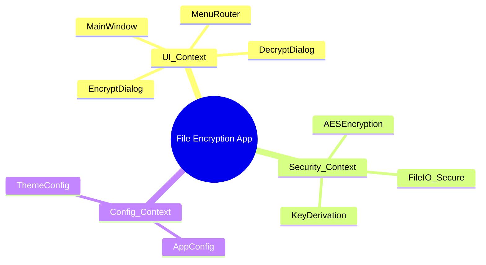
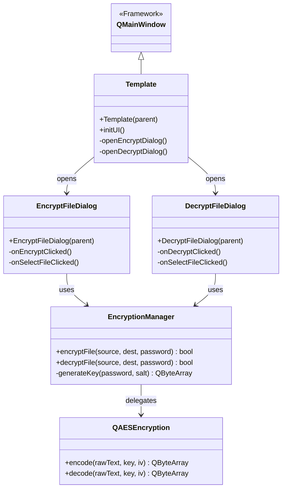
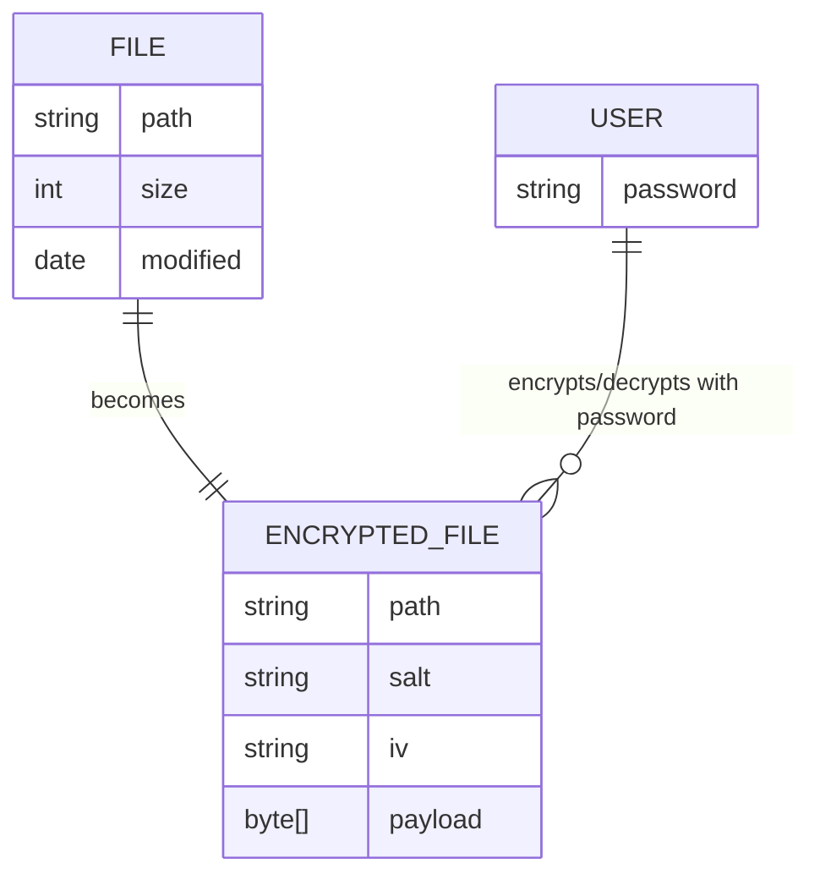
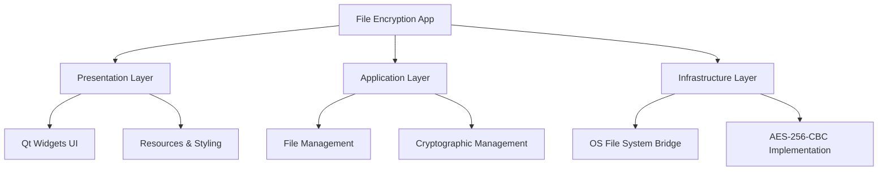

# Architecture & Design Views

## Bounded Contexts


## Class Diagram


## Component Diagram
```mermaid
componentDiagram
  package "User Interface" {
    [Main Window]
    [Encrypt Dialog]
    [Decrypt Dialog]
  }
  
  package "Business Logic" {
    [Encryption Manager]
    [Config Loader]
  }
  
  package "Core Cryptography" {
    [QAESEncryption]
    [OpenSSL/QtCrypto]
  }
  
  [Main Window] --> [Encrypt Dialog]
  [Main Window] --> [Decrypt Dialog]
  [Encrypt Dialog] --> [Encryption Manager]
  [Decrypt Dialog] --> [Encryption Manager]
  [Encryption Manager] --> [QAESEncryption]
```

## Entity Relationship Diagram


## Logical Decomposition Diagram

