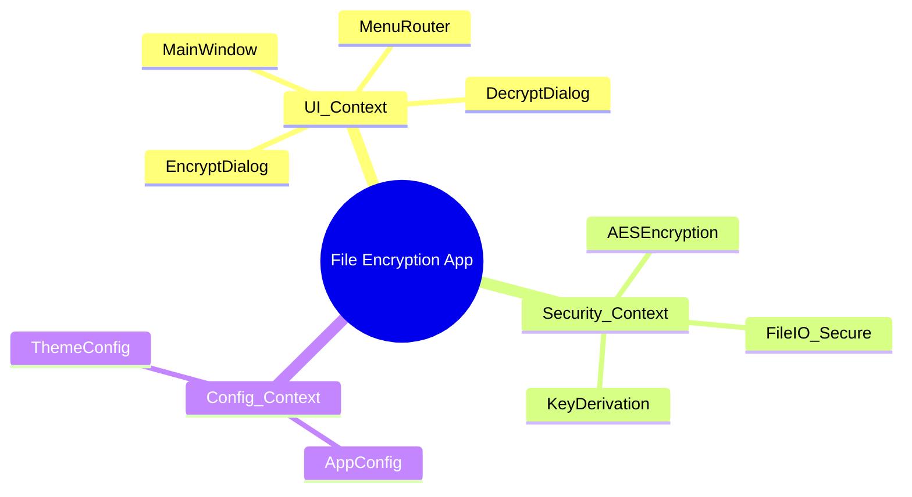
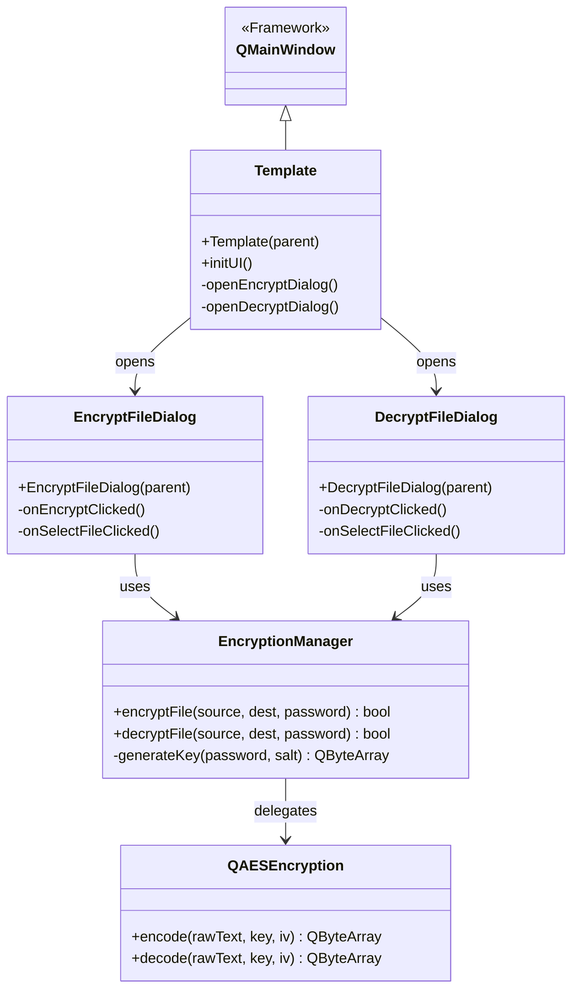
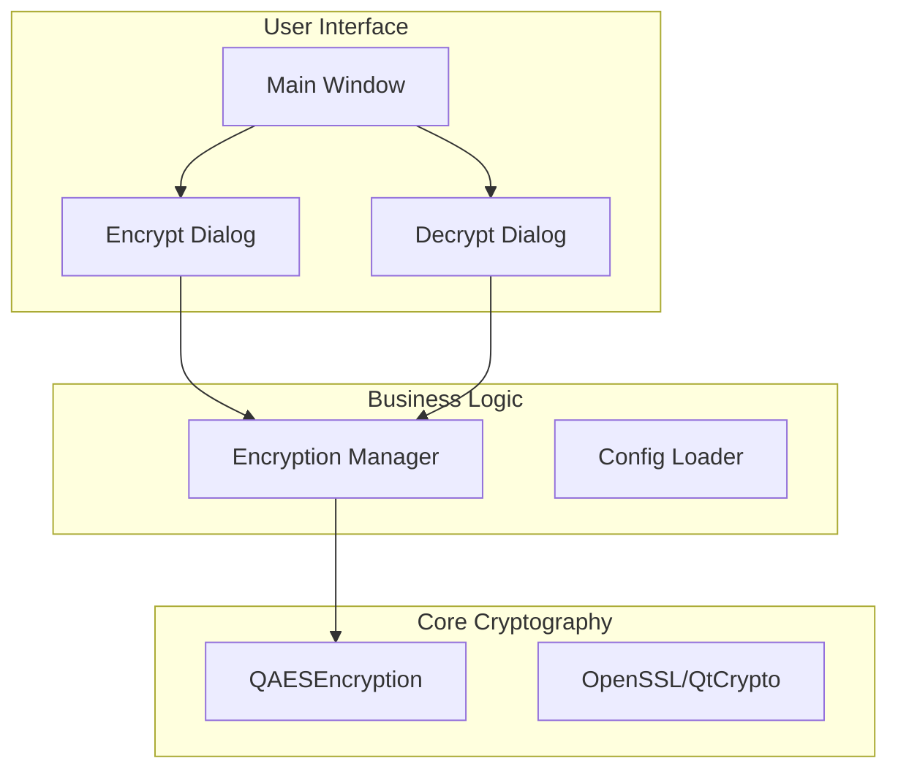
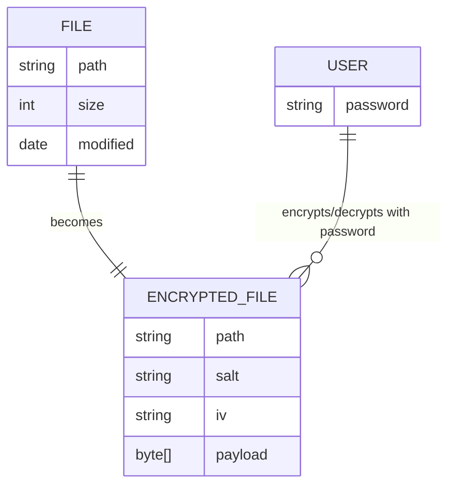
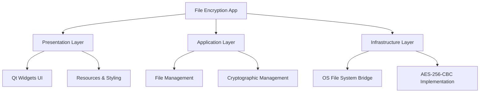

# Architecture & Design Views

---

<!-- START doctoc generated TOC please keep comment here to allow auto update -->
<!-- DON'T EDIT THIS SECTION, INSTEAD RE-RUN doctoc TO UPDATE -->
**Table of Contents**

- [Bounded Contexts](#bounded-contexts)
- [Class Diagram](#class-diagram)
- [Component Diagram](#component-diagram)
- [Entity Relationship Diagram](#entity-relationship-diagram)
- [Logical Decomposition Diagram](#logical-decomposition-diagram)

<!-- END doctoc generated TOC please keep comment here to allow auto update -->

---

## Bounded Contexts

## Class Diagram

## Component Diagram

## Entity Relationship Diagram

## Logical Decomposition Diagram

