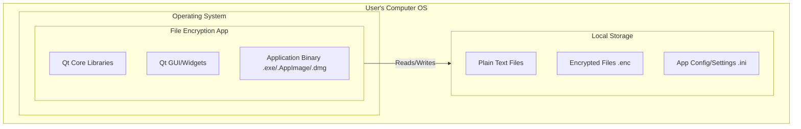
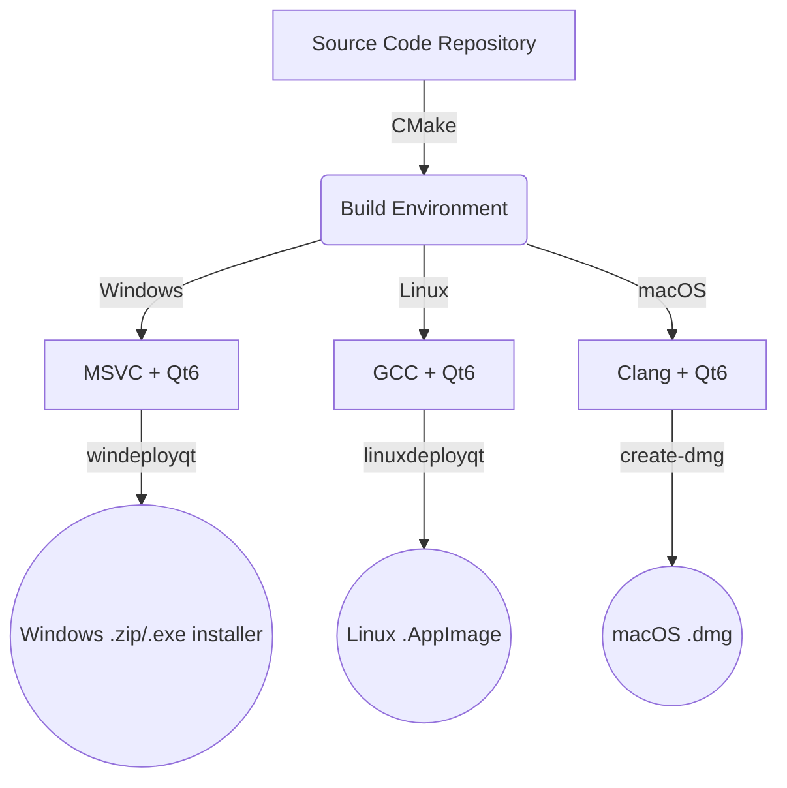
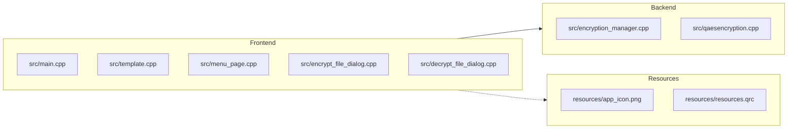
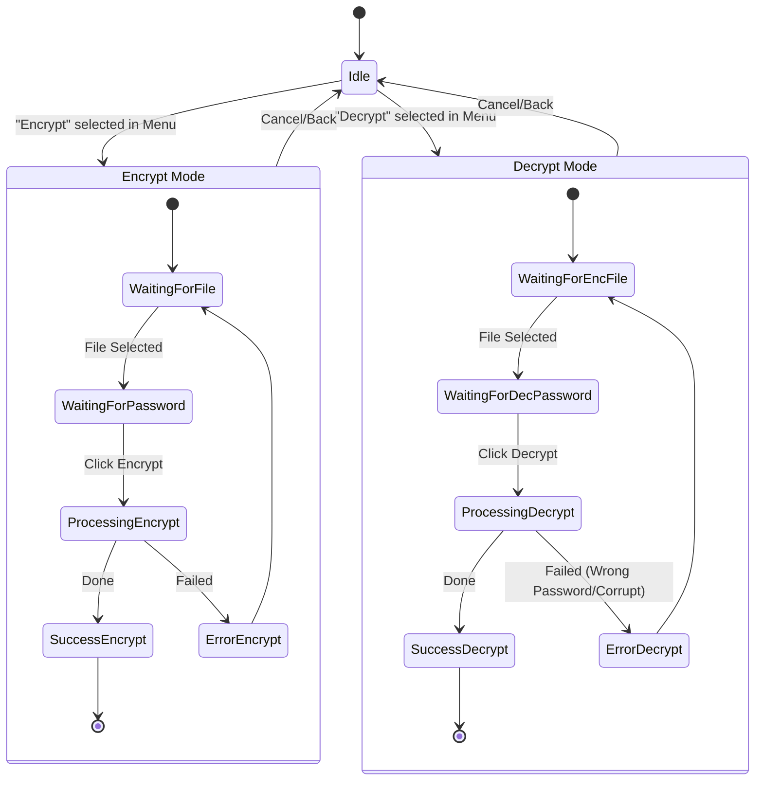
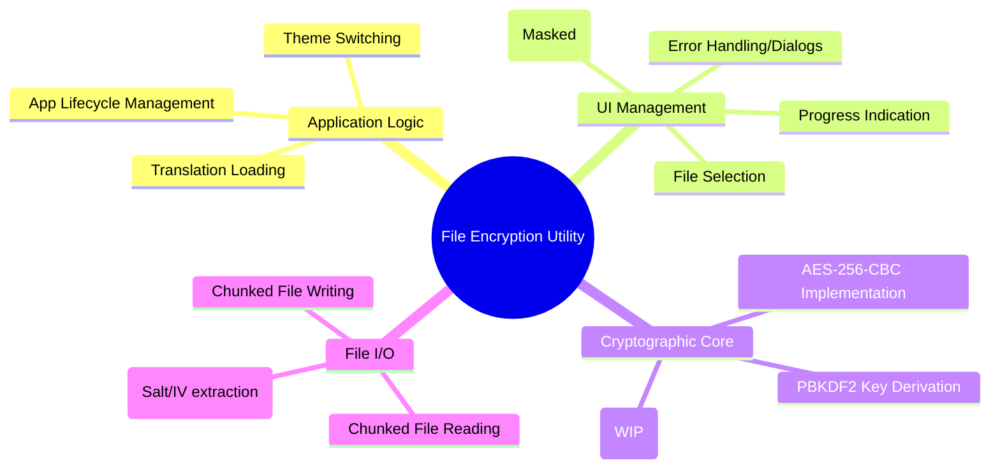

# Deployment & Physical Views

## Deployment Diagram

```mermaid
graph TD
  subgraph PC[User's Computer OS]
    subgraph OS[Operating System]
      subgraph App[File Encryption App]
        QtCore[Qt Core Libraries]
        QtGui[Qt GUI/Widgets]
        AppBinary[Application Binary .exe/.AppImage/.dmg]
      end
    end
    
    subgraph HDD[Local Storage]
      PlainText[Plain Text Files]
      EncryptedFiles[Encrypted Files .enc]
      AppConfig[App Config/Settings .ini]
    end
  end
  
  App -->|Reads/Writes| HDD
```

## Physical Decomposition Diagram

```mermaid
graph TD
  Source[Source Code Repository]
  Source --> |CMake| BuildEnv(Build Environment)
  BuildEnv --> |Windows| BuildWindows[MSVC + Qt6]
  BuildEnv --> |Linux| BuildLinux[GCC + Qt6]
  BuildEnv --> |macOS| BuildMac[Clang + Qt6]
  
  BuildWindows --> |windeployqt| ZIPInstaller((Windows .zip/.exe installer))
  BuildLinux --> |linuxdeployqt| AppImageInstaller((Linux .AppImage))
  BuildMac --> |create-dmg| DMGInstaller((macOS .dmg))
```

## Development View

```mermaid
graph LR
  subgraph Frontend
    src/main.cpp
    src/template.cpp
    src/menu_page.cpp
    src/encrypt_file_dialog.cpp
    src/decrypt_file_dialog.cpp
  end
  
  subgraph Backend
    src/encryption_manager.cpp
    src/qaesencryption.cpp
  end
  
  subgraph Resources
    resources/app_icon.png
    resources/resources.qrc
  end
  
  Frontend --> Backend
  Frontend -.-> Resources
```

## State Diagram

```mermaid
stateDiagram-v2
    [*] --> Idle
    
    state "Encrypt Mode" as Encrypt {
      [*] --> WaitingForFile
      WaitingForFile --> WaitingForPassword : File Selected
      WaitingForPassword --> ProcessingEncrypt : Click Encrypt
      ProcessingEncrypt --> SuccessEncrypt : Done
      ProcessingEncrypt --> ErrorEncrypt : Failed
      SuccessEncrypt --> [*]
      ErrorEncrypt --> WaitingForFile
    }
    
    state "Decrypt Mode" as Decrypt {
      [*] --> WaitingForEncFile
      WaitingForEncFile --> WaitingForDecPassword : File Selected
      WaitingForDecPassword --> ProcessingDecrypt : Click Decrypt
      ProcessingDecrypt --> SuccessDecrypt : Done
      ProcessingDecrypt --> ErrorDecrypt : Failed (Wrong Password/Corrupt)
      SuccessDecrypt --> [*]
      ErrorDecrypt --> WaitingForEncFile
    }
    
    Idle --> Encrypt : "Encrypt" selected in Menu
    Idle --> Decrypt : "Decrypt" selected in Menu
    
    Encrypt --> Idle : Cancel/Back
    Decrypt --> Idle : Cancel/Back
```

## Functional Decomposition Diagram

```mermaid
mindmap
  root((File Encryption Utility))
    Application Logic
      App Lifecycle Management
      Theme Switching
      Translation Loading
    UI Management
      File Selection
      Password Input (Masked)
      Progress Indication
      Error Handling/Dialogs
    Cryptographic Core
      AES-256-CBC Implementation
      PBKDF2 Key Derivation
      Secure Memory Handling (WIP)
    File I/O
      Chunked File Reading
      Chunked File Writing
      Header Parsing (Salt/IV extraction)
```
