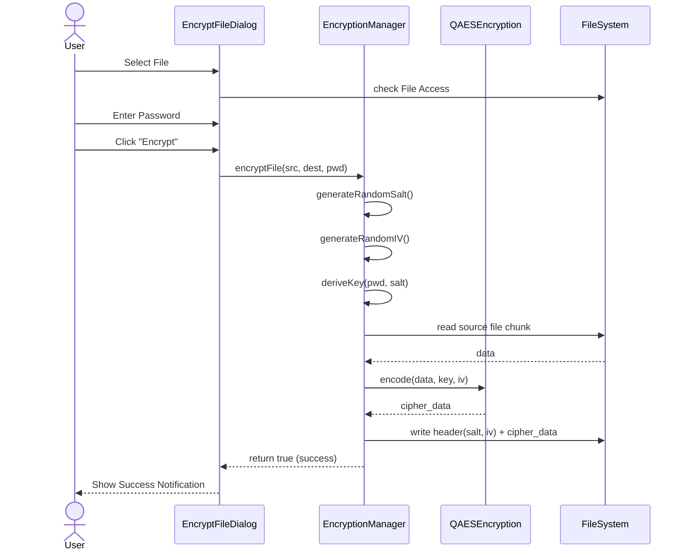

# Use Cases & Process Views

## Use Case Diagram
```mermaid
usecaseDiagram
  actor User
  
  rectangle "File Encryption App" {
    usecase "Encrypt a File" as UC1
    usecase "Decrypt a File" as UC2
    usecase "Configure App" as UC3
    
    usecase "Select Source File" as UC1a
    usecase "Enter Password" as UC1b
    usecase "Save Destination File" as UC1c
  }
  
  User --> UC1
  User --> UC2
  User --> UC3
  
  UC1 ..> UC1a : include
  UC1 ..> UC1b : include
  UC1 ..> UC1c : include
  
  UC2 ..> UC1a : include
  UC2 ..> UC1b : include
  UC2 ..> UC1c : include
```

## Sequence Diagram (Encryption Flow)


## Activity Diagram (Decryption)
```mermaid
activityDiagram
  start
  :User selects encrypted file;
  :User enters password;
  :User starts Decryption;
  
  if (File Valid?) then (yes)
    :Read File Header;
    :Extract Salt & IV;
    :Derive Key (Password + Salt);
    :Read Payload Chunk;
    :Decrypt Chunk (AES-256-CBC);
    
    if (MAC/Padding Valid?) then (yes)
      :Write to Output File;
      :Show Success;
    else (no)
      :Show "Invalid Password or corrupted file";
    endif
  else (no)
    :Show "File Not Found";
  endif
  stop
```

## Flowchart
```mermaid
flowchart TD
    A[Start App] --> B{Choose Action}
    B -->|Click Encrypt| C[Open Encrypt Dialog]
    B -->|Click Decrypt| D[Open Decrypt Dialog]
    
    C --> E[Select File & Enter Password]
    E --> F[Generate Salt/IV & Key]
    F --> G[AES Encrypt Data]
    G --> H[Save .enc File]
    H --> I[Success]
    
    D --> J[Select .enc File & Enter Password]
    J --> K[Read Header (Salt/IV)]
    K --> L[Derive Key]
    L --> M[AES Decrypt Data]
    M --> N[Save original File]
    N --> I
```

## Information Flow Diagram
```mermaid
flowchart LR
    SourceFile[(Raw File)] --> |Bytes| Reader[File Reader]
    Reader --> |Plain Text Blocks| CryptoEngine((QAES Crypto))
    
    Password[User Input: Password] --> |String| KDF[Key Derivation (PBKDF2)]
    Salt[Random Salt] --> KDF
    KDF --> |256-bit Key| CryptoEngine
    
    IV[Random IV] --> CryptoEngine
    
    CryptoEngine --> |Cipher Text Blocks| Writer[File Writer]
    Writer --> OutputFile[(.enc File)]
```
