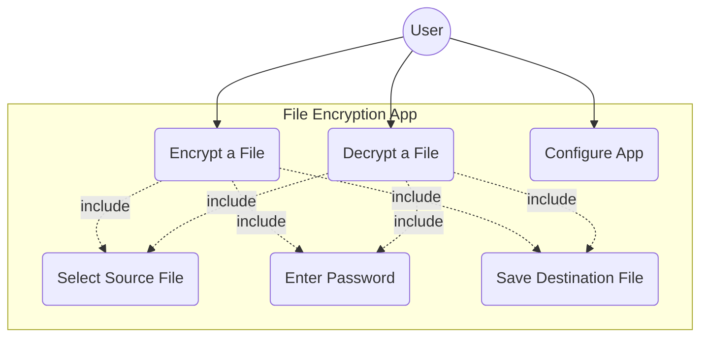
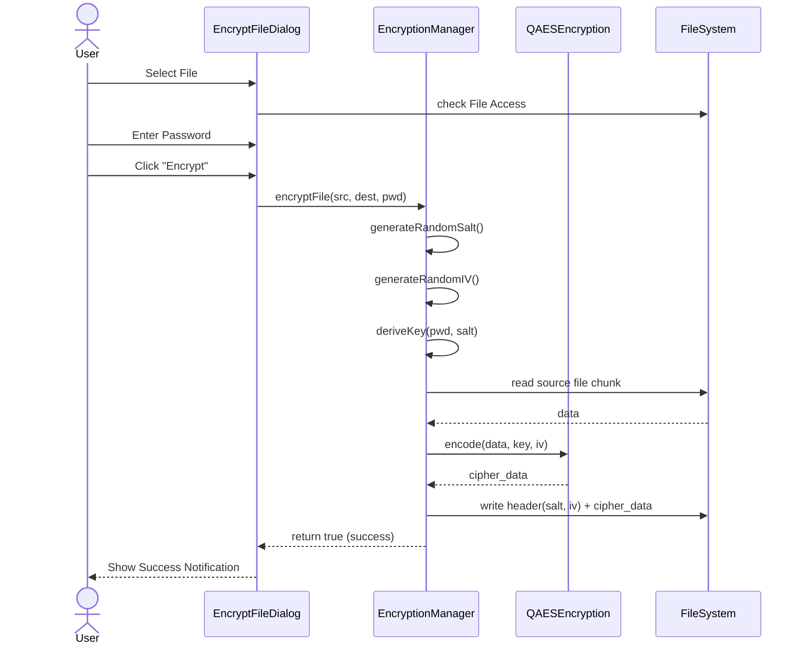
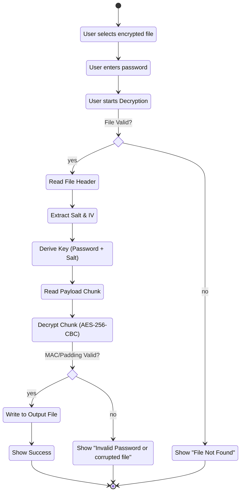
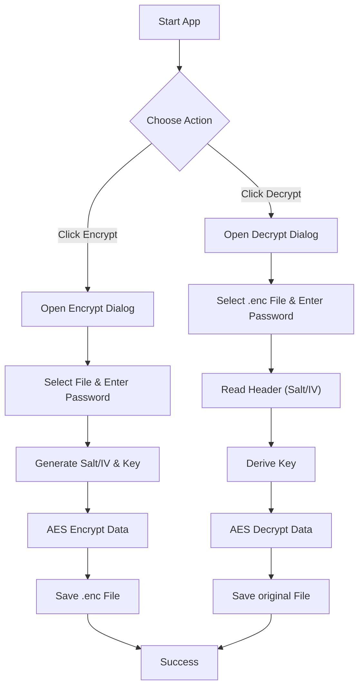
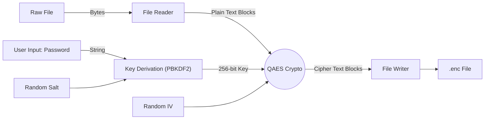

<!-- START doctoc generated TOC please keep comment here to allow auto update -->
<!-- DON'T EDIT THIS SECTION, INSTEAD RE-RUN doctoc TO UPDATE -->
**Table of Contents**

- [Use Cases & Process Views](#use-cases--process-views)
  - [Use Case Diagram](#use-case-diagram)
  - [Sequence Diagram (Encryption Flow)](#sequence-diagram-encryption-flow)
  - [Activity Diagram (Decryption)](#activity-diagram-decryption)
  - [Flowchart](#flowchart)
  - [Information Flow Diagram](#information-flow-diagram)

<!-- END doctoc generated TOC please keep comment here to allow auto update -->

# Use Cases & Process Views

## Use Case Diagram

## Sequence Diagram (Encryption Flow)

## Activity Diagram (Decryption)

## Flowchart

## Information Flow Diagram

